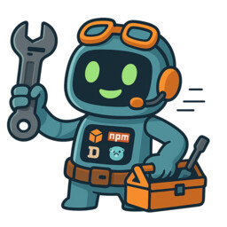

# cmd-runner

[](https://github.com/osteele/cmd-runner/actions/workflows/ci.yml)
[](https://goreportcard.com/report/github.com/osteele/cmd-runner)
[](https://pkg.go.dev/github.com/osteele/cmd-runner)
[](https://opensource.org/licenses/MIT)
[](CHANGELOG.md)

<p align="center">
  
</p>

A smart command runner that finds and executes commands across different build systems and project types.

**Why?** Working across multiple projects with different tech stacks (Rust/Cargo, Node/npm/bun, Python/uv, Go, etc.) means remembering different commands for the same tasks. Instead of trying to recall whether it's `npm run test`, `cargo test`, `go test`, or `make test`, or wondering whether this Node project uses `npm run test` or `bun test`, simply use `cmdr test` in any project.

## Quick Start

See what commands are available in any project:

```bash
$ cmdr
Available commands for this project:

npm commands:
  build        → Build the application
  test         → Run test suite
  dev          → Start development server
  lint         → Run ESLint
  format       → Format with Prettier
  typecheck    → Run TypeScript compiler checks

Synthesized commands (provided by cmd-runner):
  check        → Runs lint, typecheck, and test
  fix          → Runs format and lint fix

Command aliases:
  f  → format     t  → test       tc → typecheck
  r  → run        s  → serve      b  → build
  l  → lint
```

You can also use `cmdr --list` or `cmdr -l` for the same output with additional options like `--all` to show commands from all sources.

Now just run what you need:

```bash
$ cmdr test     # Runs npm test in this project
$ cmdr t        # Short alias for test
$ cmdr check    # Runs lint, typecheck, and test together
```

## Interactive Mode

For a more interactive experience, use the `-i` flag to launch interactive mode:

```bash
$ cmdr -i
# or
$ cr -i
```

This launches an interactive menu where you can:
- Press single keys to run common commands (`t` for test, `b` for build, etc.)
- Use `.` to repeat the last command
- Toggle between the menu and previous output with `/`
- Type command names or unique prefixes for any command
- Quit anytime with `q` or Ctrl+C

The interactive mode maintains flow - successful commands return immediately to the menu, while failures pause for review.

## Example

```bash
# In a Rust project
$ cmdr test
Running: cargo test

# In a Node project with bun
$ cmdr test
Running: bun run test

# In a project with a Makefile
$ cmdr format
Running: make format

# Or use the shorter alias
$ cr test
Running: cargo test

# Ultra-short aliases work too
$ cmdr t        # Same as: cmdr test
$ cmdr f        # Same as: cmdr format
$ cmdr b        # Same as: cmdr build
```

## Installation

```bash
go install github.com/osteele/cmd-runner/cmd/cmdr@latest
```

This installs the binary as `cmdr`. For an even shorter command, you can install the `cr` alias:

```bash
# Preview what will be changed (dry-run)
cmdr install-alias --dry-run

# Install the alias
cmdr install-alias
```

Or manually create an alias in your shell configuration:

```bash
alias cr=cmdr

# For an ultra-short alias, you could even use punctuation:
alias ,=cmdr   # Now you can type: , test
alias @=cmdr   # Now you can type: @ build
```

Or install from source:

```bash
git clone https://github.com/osteele/cmd-runner.git
cd cmd-runner
go install ./cmd/cmdr
```

## Usage

```bash
cmdr [OPTIONS] <command> [args...]
cmdr --list                      # List all available commands for current project
cmdr --list --all                # Show commands from all sources
cmdr --list --verbose            # Show full command descriptions
cmdr --help                      # Show help information
cmdr --version                   # Show version
cmdr install-alias [--dry-run]  # Install 'cr' alias to shell config
```

Options:
- `--list`, `-l` - List all available commands for current project
  - `--all`, `-a` - Show commands from all sources (not just primary)
  - `--verbose` - Show full command descriptions without truncation
- `--version`, `-v` - Show version information
- `--help`, `-h` - Show help message

Examples:
```bash
cmdr format           # Runs format or fmt command
cmdr test             # Runs test command
cmdr run              # Runs run, dev, or serve command
cmdr build -- --prod  # Runs build with additional arguments

# Or with the short alias (after installing)
cr test               # Same as cmdr test
cr format             # Same as cmdr format

# Ultra-short command aliases
cmdr f                # format
cmdr t                # test
cmdr tc               # typecheck
cmdr r                # run
cmdr s                # serve/server
cmdr b                # build
cmdr l                # lint

# Show all available commands
cmdr --list           # List commands for current project (primary source only)
cmdr -l               # Short form of --list
cmdr --list --all     # Show commands from all sources and directories
cmdr --list --verbose # Show full descriptions without truncation

# Flags are passed through to commands
cmdr test --verbose   # Runs test command with --verbose flag
cmdr build --prod     # Runs build command with --prod flag
```

### Setup vs Install

`cmdr` distinguishes between two types of installation to avoid confusion:

- **`cmdr setup`** - Install dependencies for local development
  - Downloads and installs packages needed to build and run the project locally
  - Node.js: `npm install`, `pnpm install`, `yarn`, `bun install`
  - Python: `uv sync`, `poetry install`
  - Go: `go mod download`
  - Rust: `cargo fetch`
  - Java (Maven): `mvn dependency:resolve`
  - Java (Gradle): `gradle build`

- **`cmdr install`** - Install binary/package globally for the user
  - Makes the project's executable available system-wide
  - Node.js: `npm link`, `pnpm link --global`, `yarn link`, `bun link`
  - Python: `uv tool install .`, `pip install .`
  - Go: `go install .`
  - Rust: `cargo install --path .`
  - Java (Maven): `mvn install` (to local Maven repository)
  - Java (Gradle): `gradle installDist`

**Example workflow:**

```bash
# First time working on a project - get dependencies
$ cmdr setup
Running: npm install
# ... project dependencies installed ...

# Later, after development - install your tool globally
$ cmdr install
Running: npm link
# ... binary now available globally ...
```

### Discovering Available Commands

Use `cmdr --list` to see all available commands for your current project:

```bash
$ cmdr --list
Available commands for this project:

Node.js commands:
  lint         → npm run lint
  format       → npm run format
  dev          → npm run dev
  build        → npm run build
  test         → npm run test

Command aliases:
  f  → format     t  → test       tc → typecheck
  r  → run        s  → serve      b  → build
  l  → lint
```

The list command shows:
- Commands from your build system (make, just, npm scripts, etc.)
- What each command will actually execute
- Available short aliases
- Synthesized commands provided by cmd-runner

Options for `--list`:
- By default, shows only the primary command source with descriptions truncated to terminal width
- Use `--all` to see commands from all sources (current directory and project root)
- Use `--verbose` to see full descriptions without truncation
- Use `--help` with `--list` to see available options

## Features

- Intelligent command aliasing (e.g., `run` → `dev` → `serve`)
- Searches both current directory and project root
- Passes through additional arguments to the underlying command
- Supports all major build systems and package managers

For a detailed explanation of the command discovery logic, aliasing, and supported systems, see the [**Specification**](SPECIFICATION.md).

## See Also

- [**project-version**](https://github.com/osteele/project-version) - A cross-language project version bumper that automates version bumping and releases across Node.js, Python, Rust, Go, and Ruby projects
- Check out my [development tools](https://osteele.com/software/development-tools) page for additional projects

## License

MIT License
