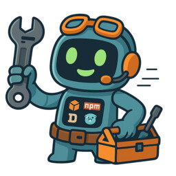

# cmd-runner

[](https://github.com/osteele/cmd-runner/actions/workflows/ci.yml)
[](https://goreportcard.com/report/github.com/osteele/cmd-runner)
[](https://pkg.go.dev/github.com/osteele/cmd-runner)
[](https://opensource.org/licenses/MIT)
[](CHANGELOG.md)

<p align="center">
  
</p>

A command runner that finds and executes familiar development commands across different build systems and project types.

Projects spell the same task in different ways: `npm run test`, `cargo test`, `go test`, or `make test`. `cmdr test` selects the command for the current project.

## Quick Start

```bash
cmdr          # List commands from the primary source
cmdr test     # Run the project's test command
cmdr t        # Short alias for test
cmdr check    # Run the native check command or synthesize one
```

Bare `cmdr`, `cmdr --list`, and `cmdr -l` produce the same command list. Add `--all` to include commands from every detected source and the project root. Add `--verbose` to show the command that each entry runs and any malformed configuration warnings.

## Installation

```bash
go install github.com/osteele/cmd-runner/cmd/cmdr@latest
```

This installs the binary as `cmdr`. The `install-alias` command adds `alias cr=cmdr` to a supported shell configuration file:

```bash
# Preview the change
cmdr install-alias --dry-run

# Install the alias
cmdr install-alias
```

You can also add the alias yourself:

```bash
alias cr=cmdr
```

To install from source:

```bash
git clone https://github.com/osteele/cmd-runner.git
cd cmd-runner
go install ./cmd/cmdr
```

## Usage

```text
cmdr [OPTIONS] [command] [args...]
```

Common invocations:

```bash
cmdr                              # List commands from the primary source
cmdr --list                       # Same as bare cmdr
cmdr --list --all                 # Include every source and the project root
cmdr --list --verbose             # Include execution details and warnings
cmdr --interactive                # Open the interactive command menu
cmdr --help                       # Show help
cmdr --version                    # Show the version
cmdr install-alias [--dry-run]    # Install the cr shell alias
```

Options:

- `--interactive`, `-i`: open the interactive command menu
- `--list`, `-l`: list commands from the primary source
  - `--all`, `-a`: include commands from all detected sources and the project root
  - `--verbose`: show full descriptions, execution commands, and malformed configuration warnings
- `--version`, `-v`: show version information
- `--help`, `-h`: show help

Options for `cmdr` must appear before the command name. Arguments after the command name pass through to the selected tool.

Examples:

```console
# Rust
$ cmdr test
Running: cargo test

# Node.js with Bun
$ cmdr test
Running: bun run test

# Make
$ cmdr format
Running: make format
```

```bash
# Command arguments pass through to the selected tool
cmdr test --verbose
cmdr build --prod
```

## Interactive Mode

Run `cmdr -i` or `cmdr --interactive` to open the terminal menu. The menu assigns single-key shortcuts to common commands and number keys to other displayed commands.

- `.` repeats the last command.
- `/` switches between the menu and the last command's output.
- `?` shows help.
- `q` or Ctrl+C exits.

You can also type a full command name or a unique prefix. Successful commands return to the menu. Failed commands pause so that you can review their output.

## Command Discovery

`cmdr` searches the current directory first. If the current directory is inside a Git or Jujutsu repository, it also searches the repository root. Within each directory, command sources have this priority:

1. mise
2. just
3. make
4. Language-specific package managers and build tools

An exact command name in any source takes precedence over an alias. For example, a real command named `f` runs before `f` is expanded to `format`.

| Project type | Detection | Commands run through |
| --- | --- | --- |
| mise | `.mise.toml` | `mise run` |
| just | `justfile` or `Justfile` | `just` |
| Make | `Makefile` or `makefile` | `make` |
| Deno | `deno.json` or `deno.jsonc` | `deno` |
| Node.js | `package.json` | Bun, pnpm, Yarn, or npm, selected from lock/config files |
| Python | `pyproject.toml` plus uv or Poetry configuration | `uv` or `poetry` |
| Rust | `Cargo.toml` | `cargo` |
| Go | `go.mod` or `go.work` | `go` |
| Gradle | `build.gradle` or `build.gradle.kts` | Gradle wrapper or `gradle` |
| Maven | `pom.xml` | Maven wrapper or `mvn` |

Deno tasks and Node.js package scripts appear by name. Cargo binary targets and projects with multiple Go main packages also expose `run:<name>` commands.

Node.js detection checks `bun.lockb`, `pnpm-lock.yaml`, `yarn.lock`, Yarn configuration files, and `package-lock.json`, in that order. It defaults to npm when none are present.

## Commands and Aliases

| Command | Alternatives | Short alias |
| --- | --- | --- |
| `format` | `fmt` | `f` |
| `test` | `tests` | `t` |
| `typecheck` | `type-check`, `types` | `tc` |
| `run` | `dev`, `serve`, `start` | `r` |
| `serve` | `dev`, `run`, `start` | `s` |
| `build` | | `b` |
| `lint` | | `l` |

`check`, `fix`, `clean`, `setup`, and `install` do not have short aliases.

When a project does not define the command directly, `cmdr` can synthesize these commands:

- `check` runs the available `lint`, `typecheck`, and `test` commands.
- `fix` runs a formatting command and a supported linter fix command.
- `typecheck` uses TypeScript, pyright, mypy, Cargo, or Go support when available. Deno provides `deno check` directly.

## Setup and Install

`setup` installs the dependencies needed to work on a project. `install` makes the project's package or executable available outside its source directory.

A project-defined `setup` or `install` command takes precedence over these built-in mappings:

- **`cmdr setup`**
  - Node.js: `npm install`, `pnpm install`, `yarn install`, or `bun install`
  - Python: `uv sync` or `poetry install`
  - Go module: `go mod download`
  - Go workspace: `go work sync`
  - Rust: `cargo fetch`
  - Maven: `mvn dependency:resolve`
  - Gradle: `gradle build`

- **`cmdr install`**
  - Node.js: `npm link`, `pnpm link --global`, `yarn link`, or `bun link`
  - Python: `uv tool install .` or `pip install .`
  - Go: `go install` for each discovered main package, including `cmd/*` layouts
  - Rust: `cargo install --path .`
  - Maven: `mvn install`
  - Gradle: `gradle installDist`

For example:

```bash
cmdr setup
Running: npm install

cmdr install
Running: npm link
```

## Command Listings

The default list shows the first detected command source. Descriptions are truncated to the terminal width.

```text
$ cmdr --list
Available commands for this project:

npm commands:
  build        → vite build
  dev          → vite
  format       → prettier --write .
  lint         → eslint .
  test         → vitest run

Command aliases:
  f  → format     t  → test       tc → typecheck
  r  → run        s  → serve      b  → build
  l  → lint
```

`cmdr --list --verbose` adds the underlying invocation, such as `(runs: npm run test)`. `cmdr --list --all` includes additional sources and commands found at the project root. Private commands whose names start with `_` or `.` do not appear in listings.

See the [specification](SPECIFICATION.md) for implementation details.

## See Also

- [**project-version**](https://github.com/osteele/project-version) is a cross-language project version bumper for Node.js, Python, Rust, Go, and Ruby projects.
- The [development tools](https://osteele.com/software/development-tools) page lists related projects.

## License

MIT License
